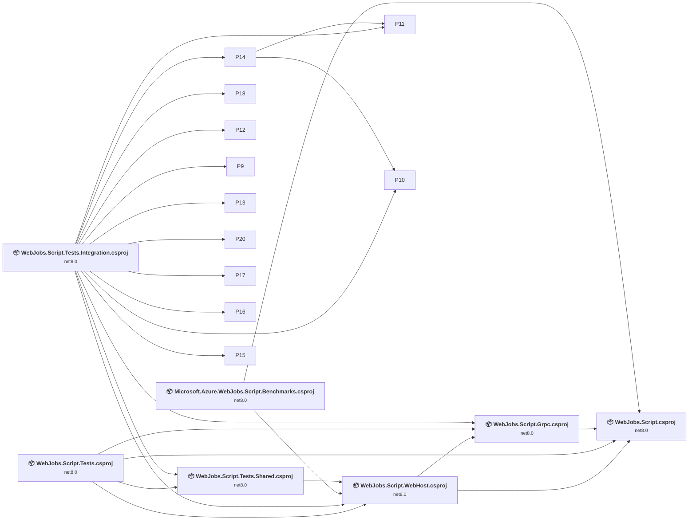
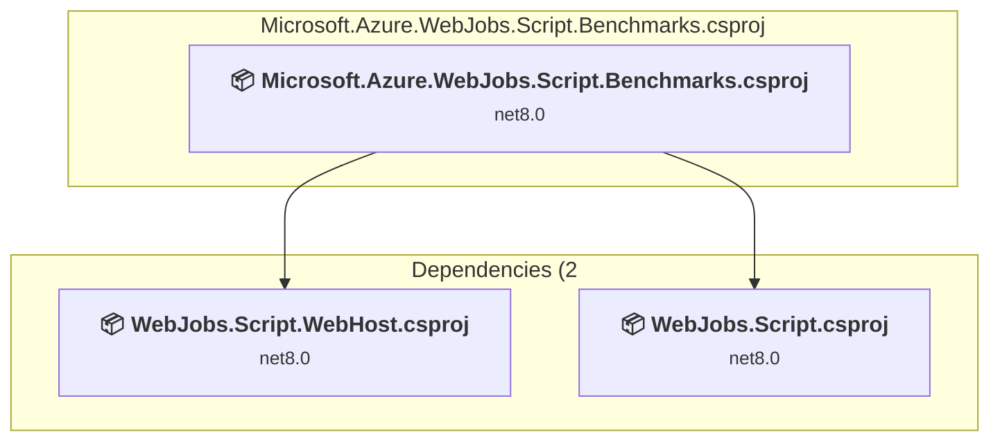
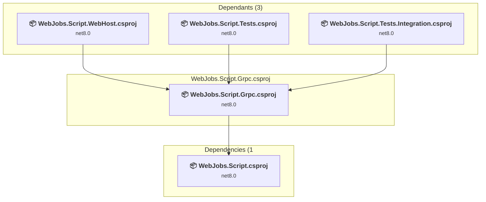
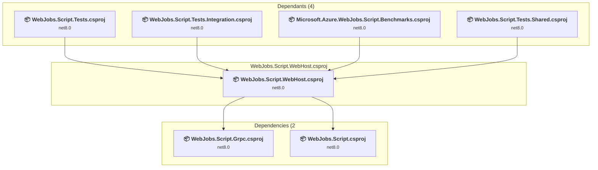
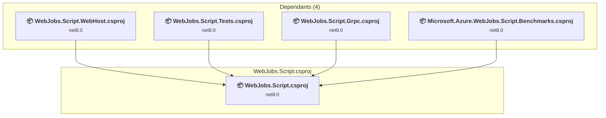
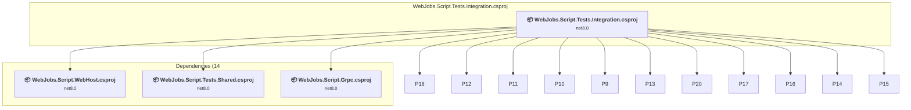
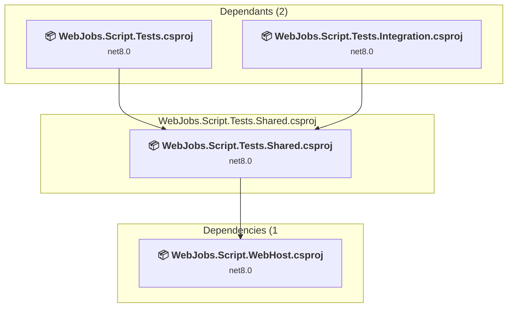
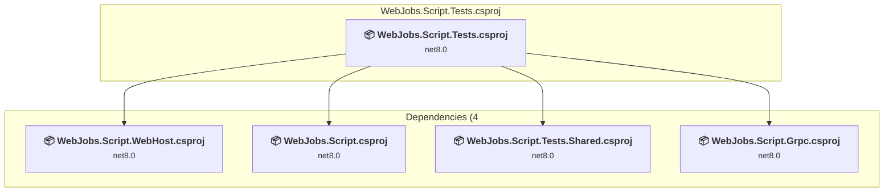

# Projects and dependencies analysis

This document provides a comprehensive overview of the projects and their dependencies in the context of upgrading to .NET 9.0.

## Table of Contents

- [Projects Relationship Graph](#projects-relationship-graph)
- [Project Details](#project-details)

  - [perf\WebJobs.Script.Benchmarks\Microsoft.Azure.WebJobs.Script.Benchmarks.csproj](#perfwebjobsscriptbenchmarksmicrosoftazurewebjobsscriptbenchmarkscsproj)
  - [src\WebJobs.Script.Grpc\WebJobs.Script.Grpc.csproj](#srcwebjobsscriptgrpcwebjobsscriptgrpccsproj)
  - [src\WebJobs.Script.WebHost\WebJobs.Script.WebHost.csproj](#srcwebjobsscriptwebhostwebjobsscriptwebhostcsproj)
  - [src\WebJobs.Script\WebJobs.Script.csproj](#srcwebjobsscriptwebjobsscriptcsproj)
  - [test\WebJobs.Script.Tests.Integration\WebJobs.Script.Tests.Integration.csproj](#testwebjobsscripttestsintegrationwebjobsscripttestsintegrationcsproj)
  - [test\WebJobs.Script.Tests.Shared\WebJobs.Script.Tests.Shared.csproj](#testwebjobsscripttestssharedwebjobsscripttestssharedcsproj)
  - [test\WebJobs.Script.Tests\WebJobs.Script.Tests.csproj](#testwebjobsscripttestswebjobsscripttestscsproj)
- [Aggregate NuGet packages details](#aggregate-nuget-packages-details)

## Projects Relationship Graph

Legend:
📦 SDK-style project
⚙️ Classic project

## Project Details

### perf\WebJobs.Script.Benchmarks\Microsoft.Azure.WebJobs.Script.Benchmarks.csproj

#### Project Info

- **Current Target Framework:** net8.0
- **Proposed Target Framework:** net10.0
- **SDK-style**: True
- **Project Kind:** DotNetCoreApp
- **Dependencies**: 2
- **Dependants**: 0
- **Number of Files**: 9
- **Lines of Code**: 354

#### Dependency Graph

Legend:
📦 SDK-style project
⚙️ Classic project

#### Project Package References

| Package | Type | Current Version | Suggested Version | Description |
| :--- | :---: | :---: | :---: | :--- |
| BenchmarkDotNet | Explicit | 0.13.1 |  | ✅Compatible |

### src\WebJobs.Script.Grpc\WebJobs.Script.Grpc.csproj

#### Project Info

- **Current Target Framework:** net8.0
- **Proposed Target Framework:** net10.0
- **SDK-style**: True
- **Project Kind:** ClassLibrary
- **Dependencies**: 1
- **Dependants**: 3
- **Number of Files**: 102
- **Lines of Code**: 10610

#### Dependency Graph

Legend:
📦 SDK-style project
⚙️ Classic project

#### Project Package References

| Package | Type | Current Version | Suggested Version | Description |
| :--- | :---: | :---: | :---: | :--- |
| Grpc.AspNetCore | Explicit | 2.55.0 |  | ✅Compatible |
| Microsoft.Azure.WebJobs.Rpc.Core | Explicit | 3.0.37 |  | ✅Compatible |
| StyleCop.Analyzers | Global | 1.2.0-beta.556 |  | ✅Compatible |

### src\WebJobs.Script.WebHost\WebJobs.Script.WebHost.csproj

#### Project Info

- **Current Target Framework:** net8.0
- **Proposed Target Framework:** net10.0
- **SDK-style**: True
- **Project Kind:** AspNetCore
- **Dependencies**: 2
- **Dependants**: 4
- **Number of Files**: 329
- **Lines of Code**: 29221

#### Dependency Graph

Legend:
📦 SDK-style project
⚙️ Classic project

#### Project Package References

| Package | Type | Current Version | Suggested Version | Description |
| :--- | :---: | :---: | :---: | :--- |
| AspNetCore.HealthChecks.UI.Client | Explicit | 9.0.0 |  | ✅Compatible |
| Azure.Security.KeyVault.Secrets | Explicit | 4.6.0 |  | ✅Compatible |
| Microsoft.AspNet.WebApi.Client | Explicit | 5.2.8 |  | ✅Compatible |
| Microsoft.AspNetCore.Authentication.JwtBearer | Explicit | 6.0.0 | 10.0.0 | NuGet package upgrade is recommended |
| Microsoft.AspNetCore.Mvc.NewtonsoftJson | Explicit | 8.0.1 | 10.0.0 | NuGet package upgrade is recommended |
| Microsoft.Azure.AppService.Middleware.Functions | Explicit | 1.5.8 |  | ✅Compatible |
| Microsoft.Azure.AppService.Proxy.Client | Explicit | 2.3.20240307.67 |  | ✅Compatible |
| Microsoft.Azure.Functions.DotNetIsolatedNativeHost | Explicit | 1.0.13 |  | ✅Compatible |
| Microsoft.Azure.Functions.JavaWorker | Explicit | 2.19.2 |  | ✅Compatible |
| Microsoft.Azure.Functions.NodeJsWorker | Explicit | 3.12.0 |  | ✅Compatible |
| Microsoft.Azure.Functions.Platform.Metrics.LinuxConsumption | Explicit | 1.0.5 |  | ✅Compatible |
| Microsoft.Azure.Functions.PowerShellWorker.PS7.0 | Explicit | 4.0.3148 |  | ✅Compatible |
| Microsoft.Azure.Functions.PowerShellWorker.PS7.2 | Explicit | 4.0.4025 |  | ✅Compatible |
| Microsoft.Azure.Functions.PowerShellWorker.PS7.4 | Explicit | 4.0.4581 |  | ✅Compatible |
| Microsoft.Azure.Functions.PythonWorker | Explicit | 4.40.2 |  | ✅Compatible |
| Microsoft.Azure.Storage.File | Explicit | 11.1.7 |  | ⚠️NuGet package is deprecated |
| Microsoft.Azure.WebSites.DataProtection | Explicit | 2.1.91-alpha |  | ✅Compatible |
| Microsoft.Security.Utilities | Explicit | 1.3.0 |  | ⚠️NuGet package is deprecated |
| StyleCop.Analyzers | Global | 1.2.0-beta.556 |  | ✅Compatible |
| System.Net.NameResolution | Explicit | 4.3.0 |  | NuGet package functionality is included with framework reference |

### src\WebJobs.Script\WebJobs.Script.csproj

#### Project Info

- **Current Target Framework:** net8.0
- **Proposed Target Framework:** net10.0
- **SDK-style**: True
- **Project Kind:** ClassLibrary
- **Dependencies**: 0
- **Dependants**: 4
- **Number of Files**: 398
- **Lines of Code**: 33398

#### Dependency Graph

Legend:
📦 SDK-style project
⚙️ Classic project

#### Project Package References

| Package | Type | Current Version | Suggested Version | Description |
| :--- | :---: | :---: | :---: | :--- |
| Azure.Data.Tables | Explicit | 12.8.3 |  | ✅Compatible |
| Azure.Monitor.OpenTelemetry.Exporter | Explicit | 1.4.0 |  | ✅Compatible |
| Azure.Storage.Blobs | Explicit | 12.19.1 |  | ✅Compatible |
| Microsoft.ApplicationInsights.AspNetCore | Explicit | 2.22.0 |  | ⚠️NuGet package is deprecated |
| Microsoft.AspNetCore.Mvc.WebApiCompatShim | Explicit | 2.2.0 |  | ⚠️NuGet package is deprecated |
| Microsoft.Azure.AppService.Proxy.Client | Explicit | 2.3.20240307.67 |  | ✅Compatible |
| Microsoft.Azure.WebJobs | Explicit | 3.0.42 |  | ✅Compatible |
| Microsoft.Azure.WebJobs.Extensions | Explicit | 5.2.1 |  | ✅Compatible |
| Microsoft.Azure.WebJobs.Extensions.Http | Explicit | 3.2.0 |  | ✅Compatible |
| Microsoft.Azure.WebJobs.Extensions.Timers.Storage | Explicit | 1.0.0-beta.1 |  | ✅Compatible |
| Microsoft.Azure.WebJobs.Host.Storage | Explicit | 5.0.1 |  | ✅Compatible |
| Microsoft.Azure.WebJobs.Logging.ApplicationInsights | Explicit | 3.0.42-12121 |  | ✅Compatible |
| Microsoft.Azure.WebJobs.Script.Abstractions | Explicit | 1.0.4-preview |  | ✅Compatible |
| Microsoft.CodeAnalysis.CSharp.Scripting | Explicit | 3.3.1 |  | ✅Compatible |
| Microsoft.Extensions.Azure | Explicit | 1.12.0 |  | ⚠️NuGet package is deprecated |
| Microsoft.Extensions.Http.Polly | Explicit | 8.0.7 | 10.0.0 | NuGet package upgrade is recommended |
| Microsoft.Extensions.Telemetry.Abstractions | Explicit | 9.8.0 |  | ✅Compatible |
| Mono.Posix.NETStandard | Explicit | 1.0.0 |  | ⚠️NuGet package is incompatible |
| NuGet.ProjectModel | Explicit | 5.11.6 |  | ✅Compatible |
| OpenTelemetry.Exporter.OpenTelemetryProtocol | Explicit | 1.12.0 |  | ✅Compatible |
| OpenTelemetry.Instrumentation.AspNetCore | Explicit | 1.12.0 |  | ✅Compatible |
| OpenTelemetry.Instrumentation.Http | Explicit | 1.12.0 |  | ✅Compatible |
| OpenTelemetry.Instrumentation.Process | Explicit | 0.5.0-beta.7 |  | ✅Compatible |
| OpenTelemetry.Instrumentation.Runtime | Explicit | 1.12.0 |  | ✅Compatible |
| StyleCop.Analyzers | Global | 1.2.0-beta.556 |  | ✅Compatible |
| System.IO.Abstractions | Explicit | 2.1.0.227 |  | ✅Compatible |
| System.Reactive.Core | Explicit | 5.0.0 |  | ✅Compatible |
| System.Reactive.Linq | Explicit | 5.0.0 |  | ✅Compatible |
| Yarp.ReverseProxy | Explicit | 2.0.1 |  | ✅Compatible |

### test\WebJobs.Script.Tests.Integration\WebJobs.Script.Tests.Integration.csproj

#### Project Info

- **Current Target Framework:** net8.0
- **Proposed Target Framework:** net10.0
- **SDK-style**: True
- **Project Kind:** AspNetCore
- **Dependencies**: 14
- **Dependants**: 0
- **Number of Files**: 136
- **Lines of Code**: 28069

#### Dependency Graph

Legend:
📦 SDK-style project
⚙️ Classic project

#### Project Package References

| Package | Type | Current Version | Suggested Version | Description |
| :--- | :---: | :---: | :---: | :--- |
| Microsoft.AspNet.WebApi.Core | Explicit | 5.2.6 |  | ⚠️NuGet package is incompatible |
| Microsoft.AspNetCore.TestHost | Explicit | 8.0.1 | 10.0.0 | NuGet package upgrade is recommended |
| Microsoft.Azure.DocumentDB.Core | Explicit | 2.11.2 |  | ⚠️NuGet package is deprecated |
| Microsoft.Azure.Functions.DotNetIsolatedNativeHost | Explicit | 1.0.13 |  | ✅Compatible |
| Microsoft.Azure.Functions.JavaWorker | Explicit | 2.19.2 |  | ✅Compatible |
| Microsoft.Azure.Functions.NodeJsWorker | Explicit | 3.12.0 |  | ✅Compatible |
| Microsoft.Azure.Functions.PowerShellWorker.PS7.0 | Explicit | 4.0.3148 |  | ✅Compatible |
| Microsoft.Azure.Functions.PowerShellWorker.PS7.2 | Explicit | 4.0.4025 |  | ✅Compatible |
| Microsoft.Azure.Functions.PowerShellWorker.PS7.4 | Explicit | 4.0.4581 |  | ✅Compatible |
| Microsoft.Azure.Functions.PythonWorker | Explicit | 4.40.2 |  | ✅Compatible |
| Microsoft.Azure.WebJobs.Extensions.Storage | Explicit | 4.0.5-11874 |  | ✅Compatible |
| Microsoft.NET.Test.Sdk | Explicit | 17.4.1 |  | ✅Compatible |
| Moq | Explicit | 4.18.4 |  | ✅Compatible |
| xunit | Explicit | 2.4.1 |  | ✅Compatible |
| xunit.runner.visualstudio | Explicit | 2.8.2 |  | ✅Compatible |

### test\WebJobs.Script.Tests.Shared\WebJobs.Script.Tests.Shared.csproj

#### Project Info

- **Current Target Framework:** net8.0
- **Proposed Target Framework:** net10.0
- **SDK-style**: True
- **Project Kind:** ClassLibrary
- **Dependencies**: 1
- **Dependants**: 2
- **Number of Files**: 46
- **Lines of Code**: 3011

#### Dependency Graph

Legend:
📦 SDK-style project
⚙️ Classic project

#### Project Package References

| Package | Type | Current Version | Suggested Version | Description |
| :--- | :---: | :---: | :---: | :--- |
| Microsoft.Azure.Storage.Blob | Explicit | 11.2.3 |  | ⚠️NuGet package is deprecated |
| Moq | Explicit | 4.18.4 |  | ✅Compatible |
| StyleCop.Analyzers | Global | 1.2.0-beta.556 |  | ✅Compatible |
| xunit | Explicit | 2.4.1 |  | ✅Compatible |

### test\WebJobs.Script.Tests\WebJobs.Script.Tests.csproj

#### Project Info

- **Current Target Framework:** net8.0
- **Proposed Target Framework:** net10.0
- **SDK-style**: True
- **Project Kind:** DotNetCoreApp
- **Dependencies**: 4
- **Dependants**: 0
- **Number of Files**: 282
- **Lines of Code**: 54885

#### Dependency Graph

Legend:
📦 SDK-style project
⚙️ Classic project

#### Project Package References

| Package | Type | Current Version | Suggested Version | Description |
| :--- | :---: | :---: | :---: | :--- |
| AwesomeAssertions | Explicit | 9.1.0 |  | ✅Compatible |
| AwesomeAssertions.Analyzers | Explicit | 9.0.4 |  | ✅Compatible |
| Microsoft.AspNetCore.TestHost | Explicit | 8.0.1 | 10.0.0 | NuGet package upgrade is recommended |
| Microsoft.Azure.Storage.Blob | Explicit | 11.2.3 |  | ⚠️NuGet package is deprecated |
| Microsoft.Azure.WebJobs.Extensions.Storage | Explicit | 4.0.5-11874 |  | ✅Compatible |
| Microsoft.Extensions.Diagnostics.Testing | Explicit | 8.1.0 |  | ✅Compatible |
| Microsoft.NET.Test.Sdk | Explicit | 17.4.1 |  | ✅Compatible |
| Moq | Explicit | 4.18.4 |  | ✅Compatible |
| StyleCop.Analyzers | Global | 1.2.0-beta.556 |  | ✅Compatible |
| System.IO.Abstractions.TestingHelpers | Explicit | 2.1.0.227 |  | ✅Compatible |
| xunit | Explicit | 2.4.1 |  | ✅Compatible |
| xunit.runner.visualstudio | Explicit | 2.8.2 |  | ✅Compatible |

## Aggregate NuGet packages details

| Package | Current Version | Suggested Version | Projects | Description |
| :--- | :---: | :---: | :--- | :--- |
| AspNetCore.HealthChecks.UI.Client | 9.0.0 |  | [WebJobs.Script.WebHost.csproj](#webjobsscriptwebhostcsproj) | ✅Compatible |
| AwesomeAssertions | 9.1.0 |  | [WebJobs.Script.Tests.csproj](#webjobsscripttestscsproj) | ✅Compatible |
| AwesomeAssertions.Analyzers | 9.0.4 |  | [WebJobs.Script.Tests.csproj](#webjobsscripttestscsproj) | ✅Compatible |
| Azure.Data.Tables | 12.8.3 |  | [WebJobs.Script.csproj](#webjobsscriptcsproj) | ✅Compatible |
| Azure.Monitor.OpenTelemetry.Exporter | 1.4.0 |  | [WebJobs.Script.csproj](#webjobsscriptcsproj) | ✅Compatible |
| Azure.Security.KeyVault.Secrets | 4.6.0 |  | [WebJobs.Script.WebHost.csproj](#webjobsscriptwebhostcsproj) | ✅Compatible |
| Azure.Storage.Blobs | 12.19.1 |  | [WebJobs.Script.csproj](#webjobsscriptcsproj) | ✅Compatible |
| BenchmarkDotNet | 0.13.1 |  | [Microsoft.Azure.WebJobs.Script.Benchmarks.csproj](#microsoftazurewebjobsscriptbenchmarkscsproj) | ✅Compatible |
| Grpc.AspNetCore | 2.55.0 |  | [WebJobs.Script.Grpc.csproj](#webjobsscriptgrpccsproj) | ✅Compatible |
| Microsoft.ApplicationInsights.AspNetCore | 2.22.0 |  | [WebJobs.Script.csproj](#webjobsscriptcsproj) | ⚠️NuGet package is deprecated |
| Microsoft.AspNet.WebApi.Client | 5.2.8 |  | [WebJobs.Script.WebHost.csproj](#webjobsscriptwebhostcsproj) | ✅Compatible |
| Microsoft.AspNet.WebApi.Core | 5.2.6 |  | [WebJobs.Script.Tests.Integration.csproj](#webjobsscripttestsintegrationcsproj) | ⚠️NuGet package is incompatible |
| Microsoft.AspNetCore.Authentication.JwtBearer | 6.0.0 | 10.0.0 | [WebJobs.Script.WebHost.csproj](#webjobsscriptwebhostcsproj) | NuGet package upgrade is recommended |
| Microsoft.AspNetCore.Mvc.NewtonsoftJson | 8.0.1 | 10.0.0 | [WebJobs.Script.WebHost.csproj](#webjobsscriptwebhostcsproj) | NuGet package upgrade is recommended |
| Microsoft.AspNetCore.Mvc.WebApiCompatShim | 2.2.0 |  | [WebJobs.Script.csproj](#webjobsscriptcsproj) | ⚠️NuGet package is deprecated |
| Microsoft.AspNetCore.TestHost | 8.0.1 | 10.0.0 | [WebJobs.Script.Tests.Integration.csproj](#webjobsscripttestsintegrationcsproj) [WebJobs.Script.Tests.csproj](#webjobsscripttestscsproj) | NuGet package upgrade is recommended |
| Microsoft.Azure.AppService.Middleware.Functions | 1.5.8 |  | [WebJobs.Script.WebHost.csproj](#webjobsscriptwebhostcsproj) | ✅Compatible |
| Microsoft.Azure.AppService.Proxy.Client | 2.3.20240307.67 |  | [WebJobs.Script.WebHost.csproj](#webjobsscriptwebhostcsproj) [WebJobs.Script.csproj](#webjobsscriptcsproj) | ✅Compatible |
| Microsoft.Azure.DocumentDB.Core | 2.11.2 |  | [WebJobs.Script.Tests.Integration.csproj](#webjobsscripttestsintegrationcsproj) | ⚠️NuGet package is deprecated |
| Microsoft.Azure.Functions.DotNetIsolatedNativeHost | 1.0.13 |  | [WebJobs.Script.WebHost.csproj](#webjobsscriptwebhostcsproj) [WebJobs.Script.Tests.Integration.csproj](#webjobsscripttestsintegrationcsproj) | ✅Compatible |
| Microsoft.Azure.Functions.JavaWorker | 2.19.2 |  | [WebJobs.Script.WebHost.csproj](#webjobsscriptwebhostcsproj) [WebJobs.Script.Tests.Integration.csproj](#webjobsscripttestsintegrationcsproj) | ✅Compatible |
| Microsoft.Azure.Functions.NodeJsWorker | 3.12.0 |  | [WebJobs.Script.WebHost.csproj](#webjobsscriptwebhostcsproj) [WebJobs.Script.Tests.Integration.csproj](#webjobsscripttestsintegrationcsproj) | ✅Compatible |
| Microsoft.Azure.Functions.Platform.Metrics.LinuxConsumption | 1.0.5 |  | [WebJobs.Script.WebHost.csproj](#webjobsscriptwebhostcsproj) | ✅Compatible |
| Microsoft.Azure.Functions.PowerShellWorker.PS7.0 | 4.0.3148 |  | [WebJobs.Script.WebHost.csproj](#webjobsscriptwebhostcsproj) [WebJobs.Script.Tests.Integration.csproj](#webjobsscripttestsintegrationcsproj) | ✅Compatible |
| Microsoft.Azure.Functions.PowerShellWorker.PS7.2 | 4.0.4025 |  | [WebJobs.Script.WebHost.csproj](#webjobsscriptwebhostcsproj) [WebJobs.Script.Tests.Integration.csproj](#webjobsscripttestsintegrationcsproj) | ✅Compatible |
| Microsoft.Azure.Functions.PowerShellWorker.PS7.4 | 4.0.4581 |  | [WebJobs.Script.WebHost.csproj](#webjobsscriptwebhostcsproj) [WebJobs.Script.Tests.Integration.csproj](#webjobsscripttestsintegrationcsproj) | ✅Compatible |
| Microsoft.Azure.Functions.PythonWorker | 4.40.2 |  | [WebJobs.Script.WebHost.csproj](#webjobsscriptwebhostcsproj) [WebJobs.Script.Tests.Integration.csproj](#webjobsscripttestsintegrationcsproj) | ✅Compatible |
| Microsoft.Azure.Storage.Blob | 11.2.3 |  | [WebJobs.Script.Tests.Shared.csproj](#webjobsscripttestssharedcsproj) [WebJobs.Script.Tests.csproj](#webjobsscripttestscsproj) | ⚠️NuGet package is deprecated |
| Microsoft.Azure.Storage.File | 11.1.7 |  | [WebJobs.Script.WebHost.csproj](#webjobsscriptwebhostcsproj) | ⚠️NuGet package is deprecated |
| Microsoft.Azure.WebJobs | 3.0.42 |  | [WebJobs.Script.csproj](#webjobsscriptcsproj) | ✅Compatible |
| Microsoft.Azure.WebJobs.Extensions | 5.2.1 |  | [WebJobs.Script.csproj](#webjobsscriptcsproj) | ✅Compatible |
| Microsoft.Azure.WebJobs.Extensions.Http | 3.2.0 |  | [WebJobs.Script.csproj](#webjobsscriptcsproj) | ✅Compatible |
| Microsoft.Azure.WebJobs.Extensions.Storage | 4.0.5-11874 |  | [WebJobs.Script.Tests.Integration.csproj](#webjobsscripttestsintegrationcsproj) [WebJobs.Script.Tests.csproj](#webjobsscripttestscsproj) | ✅Compatible |
| Microsoft.Azure.WebJobs.Extensions.Timers.Storage | 1.0.0-beta.1 |  | [WebJobs.Script.csproj](#webjobsscriptcsproj) | ✅Compatible |
| Microsoft.Azure.WebJobs.Host.Storage | 5.0.1 |  | [WebJobs.Script.csproj](#webjobsscriptcsproj) | ✅Compatible |
| Microsoft.Azure.WebJobs.Logging.ApplicationInsights | 3.0.42-12121 |  | [WebJobs.Script.csproj](#webjobsscriptcsproj) | ✅Compatible |
| Microsoft.Azure.WebJobs.Rpc.Core | 3.0.37 |  | [WebJobs.Script.Grpc.csproj](#webjobsscriptgrpccsproj) | ✅Compatible |
| Microsoft.Azure.WebJobs.Script.Abstractions | 1.0.4-preview |  | [WebJobs.Script.csproj](#webjobsscriptcsproj) | ✅Compatible |
| Microsoft.Azure.WebSites.DataProtection | 2.1.91-alpha |  | [WebJobs.Script.WebHost.csproj](#webjobsscriptwebhostcsproj) | ✅Compatible |
| Microsoft.CodeAnalysis.CSharp.Scripting | 3.3.1 |  | [WebJobs.Script.csproj](#webjobsscriptcsproj) | ✅Compatible |
| Microsoft.Extensions.Azure | 1.12.0 |  | [WebJobs.Script.csproj](#webjobsscriptcsproj) | ⚠️NuGet package is deprecated |
| Microsoft.Extensions.Diagnostics.Testing | 8.1.0 |  | [WebJobs.Script.Tests.csproj](#webjobsscripttestscsproj) | ✅Compatible |
| Microsoft.Extensions.Http.Polly | 8.0.7 | 10.0.0 | [WebJobs.Script.csproj](#webjobsscriptcsproj) | NuGet package upgrade is recommended |
| Microsoft.Extensions.Telemetry.Abstractions | 9.8.0 |  | [WebJobs.Script.csproj](#webjobsscriptcsproj) | ✅Compatible |
| Microsoft.NET.Test.Sdk | 17.4.1 |  | [WebJobs.Script.Tests.Integration.csproj](#webjobsscripttestsintegrationcsproj) [WebJobs.Script.Tests.csproj](#webjobsscripttestscsproj) | ✅Compatible |
| Microsoft.Security.Utilities | 1.3.0 |  | [WebJobs.Script.WebHost.csproj](#webjobsscriptwebhostcsproj) | ⚠️NuGet package is deprecated |
| Mono.Posix.NETStandard | 1.0.0 |  | [WebJobs.Script.csproj](#webjobsscriptcsproj) | ⚠️NuGet package is incompatible |
| Moq | 4.18.4 |  | [WebJobs.Script.Tests.Integration.csproj](#webjobsscripttestsintegrationcsproj) [WebJobs.Script.Tests.Shared.csproj](#webjobsscripttestssharedcsproj) [WebJobs.Script.Tests.csproj](#webjobsscripttestscsproj) | ✅Compatible |
| NuGet.ProjectModel | 5.11.6 |  | [WebJobs.Script.csproj](#webjobsscriptcsproj) | ✅Compatible |
| OpenTelemetry.Exporter.OpenTelemetryProtocol | 1.12.0 |  | [WebJobs.Script.csproj](#webjobsscriptcsproj) | ✅Compatible |
| OpenTelemetry.Instrumentation.AspNetCore | 1.12.0 |  | [WebJobs.Script.csproj](#webjobsscriptcsproj) | ✅Compatible |
| OpenTelemetry.Instrumentation.Http | 1.12.0 |  | [WebJobs.Script.csproj](#webjobsscriptcsproj) | ✅Compatible |
| OpenTelemetry.Instrumentation.Process | 0.5.0-beta.7 |  | [WebJobs.Script.csproj](#webjobsscriptcsproj) | ✅Compatible |
| OpenTelemetry.Instrumentation.Runtime | 1.12.0 |  | [WebJobs.Script.csproj](#webjobsscriptcsproj) | ✅Compatible |
| StyleCop.Analyzers | 1.2.0-beta.556 |  | [WebJobs.Script.Grpc.csproj](#webjobsscriptgrpccsproj) [WebJobs.Script.WebHost.csproj](#webjobsscriptwebhostcsproj) [WebJobs.Script.csproj](#webjobsscriptcsproj) [WebJobs.Script.Tests.Shared.csproj](#webjobsscripttestssharedcsproj) [WebJobs.Script.Tests.csproj](#webjobsscripttestscsproj) | ✅Compatible |
| System.IO.Abstractions | 2.1.0.227 |  | [WebJobs.Script.csproj](#webjobsscriptcsproj) | ✅Compatible |
| System.IO.Abstractions.TestingHelpers | 2.1.0.227 |  | [WebJobs.Script.Tests.csproj](#webjobsscripttestscsproj) | ✅Compatible |
| System.Net.NameResolution | 4.3.0 |  | [WebJobs.Script.WebHost.csproj](#webjobsscriptwebhostcsproj) | NuGet package functionality is included with framework reference |
| System.Reactive.Core | 5.0.0 |  | [WebJobs.Script.csproj](#webjobsscriptcsproj) | ✅Compatible |
| System.Reactive.Linq | 5.0.0 |  | [WebJobs.Script.csproj](#webjobsscriptcsproj) | ✅Compatible |
| xunit | 2.4.1 |  | [WebJobs.Script.Tests.Integration.csproj](#webjobsscripttestsintegrationcsproj) [WebJobs.Script.Tests.Shared.csproj](#webjobsscripttestssharedcsproj) [WebJobs.Script.Tests.csproj](#webjobsscripttestscsproj) | ✅Compatible |
| xunit.runner.visualstudio | 2.8.2 |  | [WebJobs.Script.Tests.Integration.csproj](#webjobsscripttestsintegrationcsproj) [WebJobs.Script.Tests.csproj](#webjobsscripttestscsproj) | ✅Compatible |
| Yarp.ReverseProxy | 2.0.1 |  | [WebJobs.Script.csproj](#webjobsscriptcsproj) | ✅Compatible |

