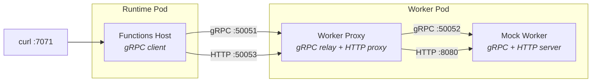
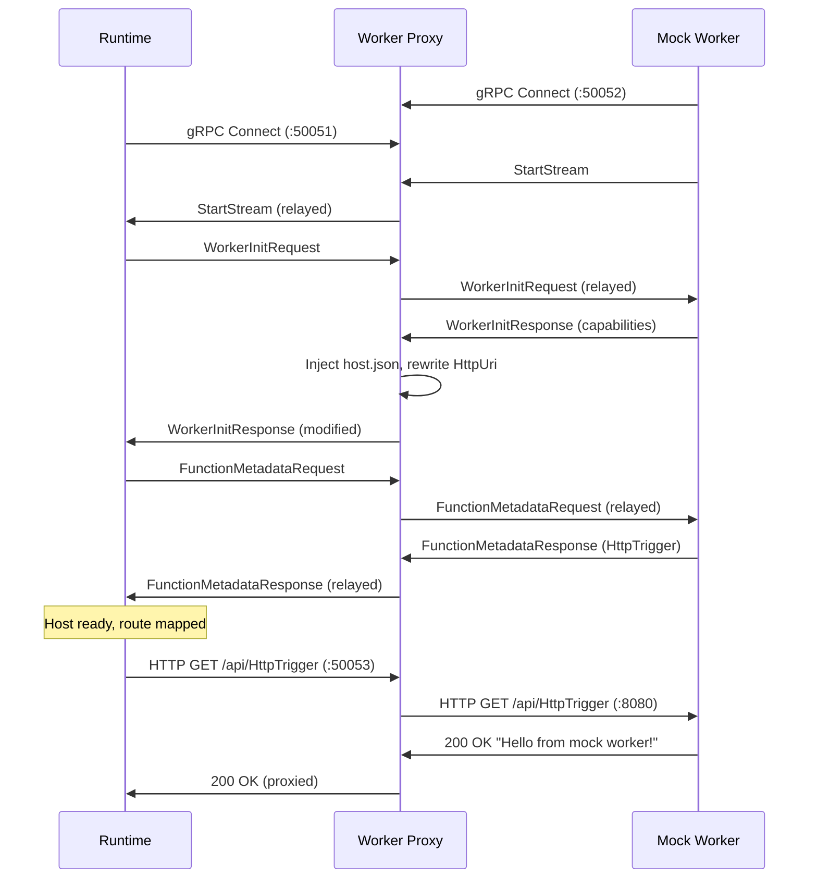

# Compute Separation Harness

E2E development harness for Azure Functions **compute separation**. Orchestrates the Functions runtime, a worker proxy (gRPC relay + HTTP proxy), and a mock worker via [.NET Aspire](https://learn.microsoft.com/dotnet/aspire).

## Architecture



| Component | Project | Description |
|-----------|---------|-------------|
| **Runtime** | `src/WebJobs.Script.WebHost` | Functions host in external worker mode (`FUNCTIONS_WORKER_EXTERNAL_ENABLED=true`). Connects outbound to the worker proxy. |
| **Worker Proxy** | `src/Functions.WorkerProxy` | gRPC relay forwarding `StreamingMessage` between runtime and worker. YARP HTTP reverse proxy for HTTP triggers. Rewrites `HttpUri` capability. |
| **Mock Worker** | `tools/ComputeSeparation/MockWorker` | Minimal gRPC worker with an HTTP server. Registers one `HttpTrigger` function, responds with `Hello from mock worker!`. |

## Prerequisites

- .NET SDK 8.0 (see `global.json`)
- Docker (for the Azurite storage emulator container; also required for container mode)

## Quick Start

Open `tools/ComputeSeparation/ComputeSeparation.sln` in Visual Studio, set **AppHost** as the startup project, and press **F5**.

Or from the command line:

```powershell
dotnet run --project tools/ComputeSeparation/AppHost/AppHost.csproj --launch-profile AppHost
```

Then:

```
curl http://localhost:7071/api/HttpTrigger
# → Hello from mock worker!
```

The Aspire dashboard is available at `http://localhost:15888` with logs and traces for all three processes.

### Container Mode

To run all components as Docker containers instead of local projects, use the
**containers** launch profile or set `UseContainers=true`:

```powershell
# Via launch profile
dotnet run --project tools/ComputeSeparation/AppHost/AppHost.csproj --launch-profile containers

# Via environment variable
$env:UseContainers = "true"
dotnet run --project tools/ComputeSeparation/AppHost/AppHost.csproj
```

Aspire builds Dockerfiles for each component, creates a shared Docker network,
and resolves endpoint references automatically — containers address each other by
resource name rather than `localhost`.

## E2E Integration Test

The test starts all processes automatically and verifies the HTTP trigger response:

```powershell
dotnet build ComputeSeparation.sln -c release
dotnet test test/WebJobs.Script.Tests.Integration -c release --no-build --filter "FullyQualifiedName~ExternalWorkerEndToEndTests"
```

## Message Flow



## Port Reference

| Port | Protocol | Description |
|------|----------|-------------|
| 7071 | HTTP/1.1 | Functions host HTTP endpoint |
| 50051 | HTTP/2 (gRPC) | Runtime → Worker Proxy |
| 50052 | HTTP/2 (gRPC) | Worker → Worker Proxy |
| 50053 | HTTP/1.1 | HTTP proxy (Runtime → Worker via Proxy) |
| 8080 | HTTP/1.1 | Mock Worker HTTP server |

## Environment Variables

| Variable | Value | Set On |
|----------|-------|--------|
| `FUNCTIONS_WORKER_EXTERNAL_ENABLED` | `true` | Runtime |
| `FUNCTIONS_WORKER_EXTERNAL_GRPC_ENDPOINT` | `http://localhost:50051` | Runtime |
| `FUNCTIONS_WORKER_RUNTIME` | `node` | Runtime |
