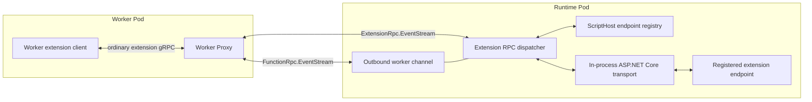
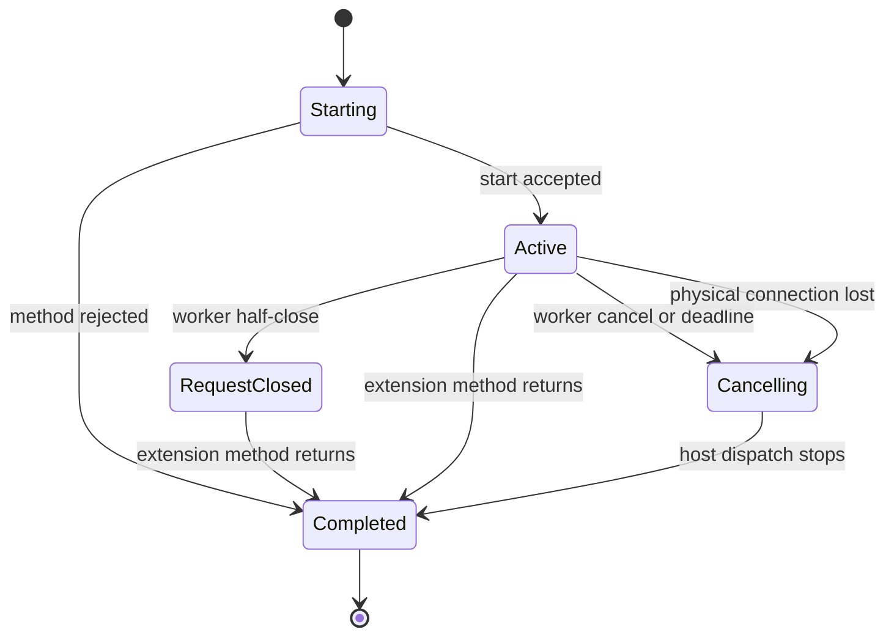
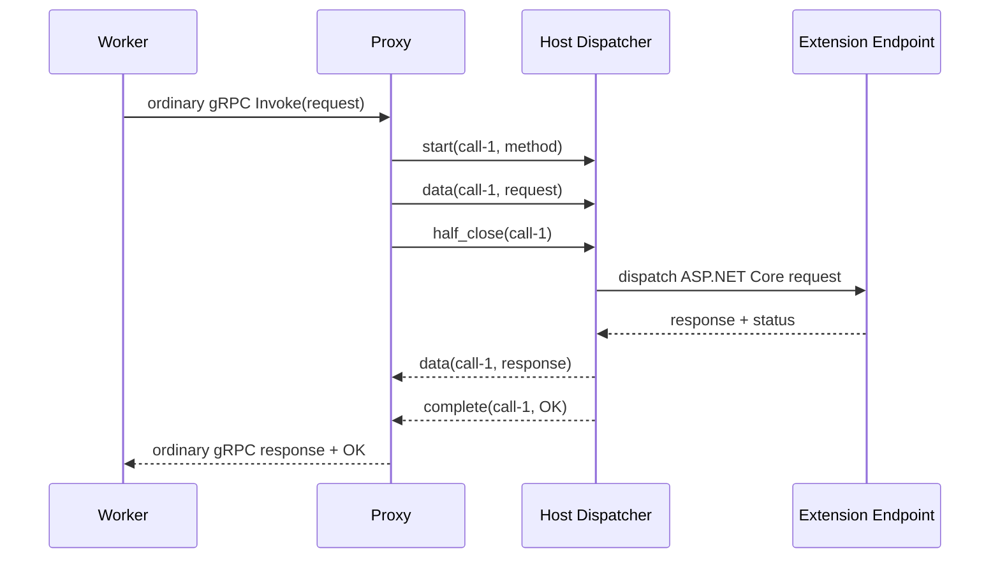
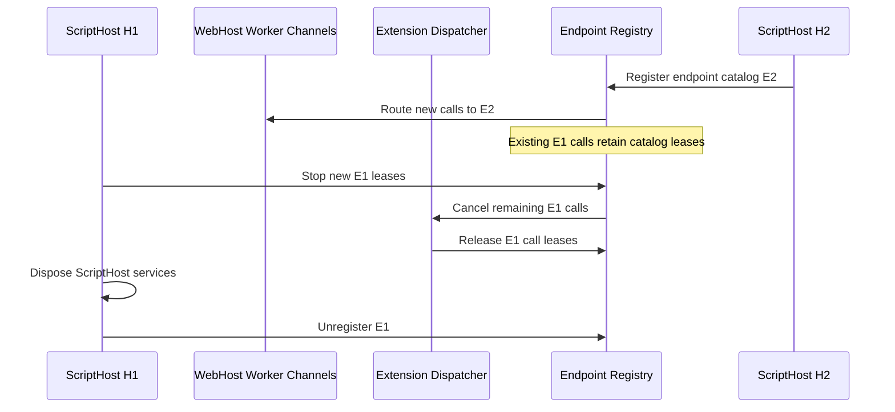

# gRPC Extensibility over the Worker Channel

## Summary

Compute separation reverses the Functions host-to-worker gRPC topology. The host
is now a gRPC client that connects to a worker proxy, while the language worker
also connects to the proxy:

```text
Host (client) --> Worker Proxy (server) <-- Worker (client)
```

The existing gRPC extensibility feature assumes that the host exposes an
ASP.NET Core gRPC server. WebJobs extensions register gRPC endpoints with the
WebJobs SDK, and workers call those endpoints through a host listener.

This design preserves the extension registration API while removing the
requirement for workers to connect to a host listener. Extension RPC calls are
represented as logical calls multiplexed over one fixed host-initiated
extension stream. An in-process host transport converts those logical call
messages into ASP.NET Core requests and dispatches them to the registered
extension endpoints.

Each ScriptHost owns a separate extension endpoint catalog. New calls from a
WebHost-owned worker channel route to the newest ScriptHost catalog, while calls
already dispatched retain a lease on their original catalog and service
provider. This also addresses the endpoint lifetime mismatch described in
[azure-functions-host#10540](https://github.com/Azure/azure-functions-host/issues/10540).

The proxy remains unaware of extension methods and payloads. It relays
extension transport messages and couples the lifetime of its host-facing and
worker-facing connections.

## Goals

- Preserve the existing WebJobs extension endpoint registration API.
- Carry extension RPC calls over one dedicated, reconnecting extension
  `EventStream` per worker channel.
- Support unary, client-streaming, server-streaming, and bidirectional-streaming
  methods.
- Preserve normal ASP.NET Core gRPC behavior for serialization, dependency
  injection, interceptors, cancellation, deadlines, status, and trailers.
- Allow multiple extension calls to execute concurrently over one worker
  channel.
- Define deterministic behavior for half-close, cancellation, host recycle,
  worker disconnect, and proxy reconnect.
- Keep endpoint catalogs reachable for their owning ScriptHost's complete
  lifetime, including shutdown and disposal.
- Route overlapping ScriptHost generations without requiring a ScriptHost or
  invocation identifier in each extension message.
- Keep the worker proxy independent of extension contracts.
- Provide bounded resource usage and avoid one extension call blocking
  unrelated worker-channel traffic.

## Non-Goals

- Exposing extension endpoints through a host network listener in compute
  separation mode.
- Resuming an in-progress extension call after either physical gRPC connection
  is replaced.
- Allowing the proxy to deserialize extension payloads or invoke extension
  methods.
- Changing how WebJobs extensions register their ASP.NET Core gRPC endpoints.
- Defining extension-specific retry or replay semantics.

## Terminology

| Term | Meaning |
|------|---------|
| Worker channel | The long-lived `FunctionRpc.EventStream` between a client and the proxy. |
| Physical stream | A host-to-proxy or worker-to-proxy `EventStream` call. |
| Extension stream | The host-initiated `ExtensionRpc.EventStream` carrying multiple logical calls. |
| Logical call | One extension RPC call permanently assigned to the current extension stream. |
| Endpoint registration | A ScriptHost-owned catalog of extension gRPC methods and its service provider. |
| Extension session epoch | A proxy-assigned identifier for one period when both physical sides are available. |
| Call ID | An identifier unique within an extension session epoch. |
| Half-close | The caller has finished sending request messages but may continue receiving responses. |

## Current Architecture

Extensions contribute `WebJobsRpcEndpointDataSource` instances to the active
ScriptHost service provider. `ExtensionsCompositeEndpointDataSource` collects
those data sources and wraps each route so the endpoint executes in an
extension service scope.

`ExtensionsCompositeEndpointDataSource` maintains one mutable set of endpoint
sources and one extension service provider. When `ActiveHostChanged` publishes
a replacement ScriptHost, those fields are immediately replaced. Calls that
arrive from workers associated with the previous, draining ScriptHost can
therefore be routed to the replacement host or receive `UNIMPLEMENTED`.

The host currently starts a private Kestrel HTTP/2 listener. Its ASP.NET Core
pipeline:

1. Waits for extension endpoints to initialize.
2. Runs endpoint routing.
3. Maps the language worker `FunctionRpc` service.
4. Adds extension endpoint data sources.

In compute separation mode, `RpcInitializationService` is skipped because the
host no longer exposes the language worker gRPC server. This also removes the
network surface that workers previously used to call extension endpoints.

## Proposed Architecture



The design has five layers:

1. **Proxy extension ingress:** accepts ordinary extension gRPC calls from the
   worker and translates them to logical extension call events.
2. **Multiplexing protocol:** carries logical extension call events on a
   dedicated host-owned extension stream, separately from worker messages.
3. **Call dispatcher:** owns logical call state and translates protocol events
   into request and response body pipes.
4. **ScriptHost endpoint registry:** retains one independent endpoint catalog
   per ScriptHost and routes each new call to the current catalog.
5. **In-process ASP.NET Core transport:** invokes the selected gRPC request
   delegate without opening a socket.

An extension call uses an ordinary worker-to-proxy gRPC stream. It does not
create a host-to-proxy RPC per call. Instead, the runtime maintains exactly one
`ExtensionRpc.EventStream` per worker channel, and the proxy permanently assigns
each new logical call to that stream.

## ScriptHost Endpoint Registration

Each ScriptHost registers its extension endpoints independently:

```text
ScriptHostEndpointRegistry
├── ScriptHost H1
│   └── EndpointRegistration E1
│       ├── ScriptHost IServiceProvider
│       └── method path -> RouteEndpoint
└── ScriptHost H2
    └── EndpointRegistration E2
        ├── ScriptHost IServiceProvider
        └── method path -> RouteEndpoint
```

An endpoint registration:

- Is created from the ScriptHost's `WebJobsRpcEndpointDataSource` services.
- Owns change-token subscriptions for those data sources.
- Builds a method catalog keyed by exact gRPC method path.
- Wraps endpoint delegates so calls use the owning ScriptHost's service scopes.
- Remains registered until the owning ScriptHost has completed disposal.

Identical method paths may exist in multiple registrations. They do not
conflict because registrations are not merged into one global ASP.NET Core
routing table.

`ActiveHostChanged` may add a new registration but does not replace or remove
the previous registration. The ScriptHost lifecycle owner removes a
registration after that specific ScriptHost completes disposal.

## Worker Channel Routing

External worker channels are owned by the WebHost and reused across ScriptHost
generations. Each worker ID routes new calls to the newest registered endpoint
catalog:

```text
Channel C1 -> EndpointRegistration E1
H2 registers E2
Channel C1 -> EndpointRegistration E2 for new calls
Existing C1 calls -> EndpointRegistration E1 until completion
```

The routing association is host-side state and is not carried in every extension
transport message. Rebinding affects only calls that have not started. Endpoint
resolution acquires a catalog lease, so a call cannot migrate after dispatch.
A physical reconnect may create a new extension session epoch for the same
logical worker channel without changing the selected catalog for in-flight
calls.

## Extension Transport Protocol

The host-facing and worker-facing `FunctionRpc.EventStream` services and their
`StreamingMessage` values remain unchanged. A separate
`ExtensionRpc.EventStream` service carries extension RPC lifecycle messages.
The current runtime opens exactly one stream at a time:

```protobuf
message ExtensionRpcMessage {
  string session_id = 1;
  string call_id = 2;
  string shard_id = 13;

  oneof content {
    ExtensionRpcHello hello = 3;
    ExtensionRpcReady ready = 4;
    ExtensionRpcStart start = 5;
    ExtensionRpcData data = 6;
    ExtensionRpcHalfClose half_close = 7;
    ExtensionRpcCancel cancel = 8;
    ExtensionRpcHeaders headers = 9;
    ExtensionRpcComplete complete = 10;
    ExtensionRpcWindowUpdate window_update = 11;
    ExtensionRpcSessionClosed session_closed = 12;
  }
}
```

The proxy derives the worker ID from its physical worker-channel context. The
host accepts neither a worker ID nor a ScriptHost ID from extension envelopes.

### Generic Worker-Facing Ingress

The worker proxy reserves the exact `FunctionRpc.EventStream` route for the
language-worker connection. Every other HTTP/2 `application/grpc` request on
the worker gRPC port is eligible for the generic extension ingress.

The ingress requires no generated extension service descriptors. It parses only
the standard gRPC message prefix:

```text
[compressed flag: 1 byte][message length: 4 bytes][opaque message bytes]
```

Application protobuf bytes remain opaque. The proxy translates method path,
metadata, deadline, message boundaries, compression flags, response headers,
status, and trailers between the ordinary worker-facing call and extension
lifecycle events. Exact-route tests ensure the catch-all ingress never captures
`FunctionRpc` traffic.

### Extension Stream Ownership and Reconnection

Language-worker messages retain their exclusive `FunctionRpc.EventStream`. The
extension stream independently owns a bounded outbound queue, serialized writer,
reader loop, call registry, and HTTP/2 stream flow-control window.

The proxy assigns every call to the current ready extension stream. A call is
pinned to that physical stream for its complete lifetime and cannot migrate.
Individual calls never write directly to a gRPC stream.

If the stream fails while the worker channel remains alive, the runtime cancels
its logical calls and reconnects one replacement stream after a bounded delay
on the existing gRPC channel. The implementation does not scale out based on
calls, queues, bytes, or latency and has no least-loaded assignment or
scale-down behavior. The `shard_id` field remains in the wire contract so a
future protocol revision can support multiple physical streams.

### Start

When the proxy accepts an ordinary worker extension gRPC call, it sends `start`
once for that logical call. It contains:

- Fully qualified gRPC method path, such as
  `/package.Service/Method`.
- Request metadata, including binary metadata.
- Optional deadline.
- Optional tracing context.

The host first obtains the endpoint registration bound to the incoming worker
channel, then resolves the method only within that registration's catalog.
Arbitrary host HTTP routes are not eligible for dispatch.

### Data

Each `data` event contains a bounded chunk of one serialized protobuf
application message, a message identifier, its total message length, its
offset, an end-of-message flag, and a compression flag. The total length lets
the receiver emit the five-byte gRPC prefix before forwarding chunks without
buffering the complete message. Chunking bounds wire-level head-of-line
blocking while preserving application-message boundaries.

The host adds standard gRPC message framing before writing the payload to the
ASP.NET Core request body. Response framing is removed before response data is
sent to the worker.

### Half-Close

`half_close` indicates that the worker will not send more request messages for
the logical call. The host completes the call's request body pipe but leaves
the response side open.

This distinction is required for client-streaming and bidirectional-streaming
methods. A half-close is not cancellation.

### Cancellation

`cancel` terminates both directions of the logical call. It may represent:

- Explicit worker cancellation.
- A worker-side deadline.
- Disposal of the worker-side call.

The host cancels the request-aborted token and aborts the logical request. The
extension observes cancellation through `ServerCallContext.CancellationToken`.

### Headers and Completion

The host sends response headers at most once. The in-process response feature
emits them from `OnStarting`. If response data or completion occurs first, the
dispatcher emits an empty `headers` event before that event.

A per-call outbound serializer guarantees:

```text
headers -> data* -> complete
```

The host sends `complete` exactly once unless the extension session ends before
the event can be delivered.

`complete` contains:

- Final gRPC status code.
- Status detail.
- Response trailers.

After receiving all response data followed by `complete`, the proxy completes
the ordinary worker-facing gRPC response stream and exposes the status and
trailers through the worker's normal gRPC call abstraction.

## Logical Call Lifecycle



### Unary Call



Unary calls use the same call state machine as streaming calls. The protocol
does not require a unary-specific request or response type.

### Bidirectional-Streaming Call

The host starts the ASP.NET Core request when it accepts `start`. Request data
is written into a per-call pipe as messages arrive. Response data is read and
relayed concurrently.

The extension experiences normal server-side gRPC behavior:

- `IAsyncStreamReader<T>.MoveNext()` waits for the next request message.
- After worker half-close, `MoveNext()` returns `false` after buffered messages
  are consumed.
- `IServerStreamWriter<T>.WriteAsync()` produces response `data` events.
- `ServerCallContext.CancellationToken` is cancelled when the call is cancelled,
  its deadline expires, or its extension session epoch ends.
- Returning from the service method completes the logical response stream.

The worker experiences the corresponding client-side behavior:

- Response reads continue after request half-close.
- Response reads end after the host sends `complete`.
- Cancellation terminates both request and response operations.
- Final status and trailers are available after completion.

## Host Dispatcher

The host maintains a call registry keyed by:

```text
(worker ID, extension session epoch, call ID)
```

The worker channel referenced by the key holds the ScriptHost endpoint
registration used for the call. The endpoint is selected once at call start and
remains pinned for the complete logical call.

The dispatcher resolves endpoints through an endpoint-router abstraction. The
ScriptHost-scoped registry implements that abstraction; the dispatcher never
falls back to the globally active endpoint set while catalog work is incomplete.

Each call owns:

- A linked cancellation token source.
- A request body pipe.
- A response body pipe.
- Request metadata and deadline state.
- The ASP.NET Core dispatch task.
- Request and response flow-control state.
- A terminal-state guard that ensures completion occurs once.

The dispatcher validates every state transition. Invalid transitions, unknown
call IDs, duplicate starts, and data after half-close produce a per-call
protocol error. They do not terminate unrelated calls unless they indicate
corruption of their extension stream.

## In-Process ASP.NET Core Transport

The host should continue using ASP.NET Core gRPC request delegates rather than
invoking generated extension service methods directly. This preserves:

- gRPC method binding and cardinality checks.
- Protobuf marshalling.
- Interceptors.
- Extension dependency injection scopes.
- Deadlines and cancellation.
- Response headers, status, and trailers.
- Existing endpoint metadata.

The preferred implementation is a custom in-process ASP.NET Core transport
that does not bind a network listener. The dispatcher selects a
`RouteEndpoint` from the current registration, acquires a call lease, creates a feature
collection for the logical call, and invokes that endpoint's request delegate.
The features include:

- HTTP/2 request protocol and `POST` method.
- The gRPC method path.
- `application/grpc` content type.
- Request and response body pipe features.
- Request-aborted and connection lifetime features.
- Response trailers.

Endpoint routing middleware does not choose between ScriptHosts. Selection has
already occurred through the worker routing association. The selected endpoint
delegate, catalog lease, and extension service scope remain pinned for the
logical call.

## ScriptHost Shutdown and Disposal

The endpoint registration follows the owning ScriptHost lifetime rather than
the lifetime of whichever host is currently active:



ScriptHost disposal must not complete until:

- Its endpoint catalog no longer accepts new leases.
- Existing extension dispatch tasks have completed or been cancelled.
- Every call lease on its service provider has been released.

After disposal completes, the lifecycle owner unregisters the endpoint catalog.
Worker channels remain available to the replacement ScriptHost. A worker
disconnect removes its current routing association.

The required invariant is:

> Every extension call is permanently pinned to one ScriptHost endpoint
> registration, and ScriptHost disposal completes only after every call lease
> on that registration has terminated.

## Physical Connection Lifecycle

The proxy terminates independent physical streams with different contracts:

```text
Host FunctionRpc.EventStream --> Proxy
Host ExtensionRpc.EventStream --> Proxy
Worker FunctionRpc.EventStream --> Proxy
```

The proxy assigns an extension session ID and a shard ID when the runtime opens
the extension stream. Negotiation occurs on that stream. These IDs are not
exposed through the worker's `FunctionRpc.EventStream`; the shard ID is retained
for future multi-stream compatibility.

When the extension stream disconnects:

1. The host and proxy cancel every logical call assigned to that stream.
2. Buffered messages for the stream are discarded.
3. The language-worker relay remains connected.
4. The runtime opens one replacement stream after a bounded retry delay while
   the worker channel remains alive.

When the worker channel or complete host extension session ends, all extension
stream calls are cancelled. Calls are never resumed or migrated.

Logical calls are never resumed or migrated to another epoch. An extension
client may retry only according to its own retry policy and only after opening
a new logical call. Core language-worker reconnect behavior, including replay
of cached initialization messages, remains independent from extension session
reset.

## Flow Control and Resource Limits

The current relay uses unbounded channels. That is acceptable for short control
messages but unsafe for sustained extension streams.

The extension transport must enforce:

- A maximum number of active logical calls per worker.
- A maximum extension message size.
- A maximum aggregate number of buffered extension bytes per worker.
- Per-call request and response windows.
- Fair scheduling between active extension calls.
- A maximum extension data chunk size.
- Independent capacity for language-worker lifecycle and invocation messages.

Flow control is mandatory in protocol version 1. During negotiation, each side
advertises the initial receive-window bytes that apply to every new call. A
sender may transmit up to that initial credit immediately after a call starts.
Per-call `window_update` events return credits when bytes leave the receiver's
bounded buffer.

Exhausting a per-call window pauses that call's sender; it is not an error.
Exceeding a hard message-size, aggregate-buffer, or active-call limit completes
the affected call with `RESOURCE_EXHAUSTED`.

The proxy and host schedule extension chunks fairly within the stream. Dedicated
runtime and extension streams prevent an extension write from blocking worker
lifecycle or invocation messages. A slow logical call cannot consume another
call's credits or unbounded buffer capacity.

## Capability Negotiation

The proxy and host must negotiate:

- Extension multiplexing protocol version.
- Supported call cardinalities.
- Initial receive-window bytes.
- Maximum data chunk, application message, buffer, and call limits.

In compute separation, the proxy initializes the worker before the host
connects and later replays cached initialization responses. Host support
therefore cannot be negotiated reliably only through the existing
`WorkerInitRequest`.

Negotiation occurs for the extension stream:

1. The proxy sends `hello` with its supported versions, initial response receive
   window, and limits.
2. The host waits for the worker's current ScriptHost endpoint registration and
   proxy `hello`.
3. The host sends `ready` with the selected version, initial request receive
   window, effective limits, and whether extension calls are enabled.

The host always sends `ready`, including when the current ScriptHost has no
extension endpoints. In that case calls are disabled for the session. If there
is no compatible protocol version, `ready` rejects the session with a reason
and the worker fails extension call creation locally.

The proxy must not send `start` before successful readiness. The proxy does not
need to understand extension endpoint details; it only translates ordinary
worker-facing gRPC calls after the host enables extension calls for the session.

## Error Handling

| Condition | Result |
|-----------|--------|
| Unknown method | Complete call with `UNIMPLEMENTED`. |
| Duplicate call ID in the same epoch | Complete the duplicate start with `ALREADY_EXISTS`; the original call is unaffected. |
| Start before successful readiness | Complete the call with `FAILED_PRECONDITION`. |
| Unsupported protocol version | Disable extension calls for the session and report the reason in `ready`. |
| Data before start | Reject the event as a protocol error. |
| Data after half-close | Complete call with `FAILED_PRECONDITION`. |
| Invalid protobuf payload | ASP.NET Core gRPC completes the call with the corresponding deserialization error. |
| Extension exception | ASP.NET Core gRPC maps the exception to status and trailers. |
| Deadline exceeded | Cancel host dispatch and complete with `DEADLINE_EXCEEDED` when the connection remains available. |
| Worker cancellation | Cancel host dispatch; no successful completion is required. |
| ScriptHost draining | Existing bound channels and extension calls remain routable. |
| ScriptHost disposal | Close bound channels, finish or cancel calls, then unregister endpoints. |
| Physical connection loss | Cancel all calls in the epoch; no completion delivery is guaranteed. |
| Buffer or call limit exceeded | Complete the affected call with `RESOURCE_EXHAUSTED`. |

## Proxy Behavior

The proxy:

- Accepts arbitrary extension gRPC method paths through a catch-all
  worker-facing ingress while reserving the exact `FunctionRpc` route.
- Relays extension transport messages without deserializing extension
  application payloads.
- Assigns each new call to the current ready extension stream and keeps that
  assignment until completion.
- Serializes messages through the stream's exclusive writer.
- Preserves message order on each physical stream.
- Assigns extension session epochs when both physical sides are available.
- Prevents messages from a closed epoch from entering a new epoch.
- Sends `session_closed` to the surviving side after a physical disconnect.
- Applies aggregate transport limits needed to protect the proxy.

The proxy does not:

- Resolve extension methods.
- Interpret protobuf application payloads.
- Maintain ASP.NET Core endpoint state.
- Retry or replay extension calls.

## Security

- Only routes contributed through `WebJobsRpcEndpointDataSource` are eligible.
- Endpoint lookup is restricted to the registration bound to the incoming
  worker channel.
- The method path is validated before request-body processing begins.
- Metadata names and sizes are validated.
- Extension message and buffer limits are enforced at the worker, proxy, and
  host boundaries.
- Error details follow existing host gRPC disclosure behavior.
- Extension payloads are not written to logs.

## Observability

Logs and metrics should include worker ID, extension session epoch, shard ID,
call ID, and gRPC method, but never application payloads.

Recommended metrics:

- Active extension calls by method.
- Calls started, completed, cancelled, and failed.
- Call-open latency correlated with active call count.
- Call duration correlated with active call count at open and completion.
- Request and response message counts and bytes.
- Flow-control stalls.
- Extension stream connected state, active calls, and queued bytes.
- Stream opening, failure, reconnect, and write latency.
- Rejected calls by reason.
- Calls cancelled by physical connection loss.
- Concurrent ScriptHost endpoint registrations.
- Endpoint registrations retained during ScriptHost drain and removed after
  disposal.

The proxy does not reject calls at a fixed concurrency threshold. It records a
structured event when each call opens and completes, including active-call
counts, call-open latency, and total duration. These measurements provide the
evidence needed to decide whether a future protocol version should activate
multiple extension streams.

The `Microsoft.Azure.Functions.WorkerProxy.ExtensionGrpc` meter currently emits:

- `azure.functions.worker_proxy.extension_rpc.calls.active`
- `azure.functions.worker_proxy.extension_rpc.call.open.duration`
- `azure.functions.worker_proxy.extension_rpc.call.duration`

The worker-facing ASP.NET Core activity is enriched with call and stream identifiers
and active-call snapshots. Timing remains on the activity's built-in duration and the
dedicated histograms. Equivalent structured open and completion logs remain until
WorkerProxy metric exporting is wired up.

Distributed tracing metadata is propagated into the in-process ASP.NET Core
request where supported.

## Compatibility and Rollout

The feature is capability-gated. Workers without extension multiplexing support
continue using existing behavior outside compute separation mode. In compute
separation mode, attempts to use gRPC extensibility without negotiated support
fail explicitly.

A staged rollout should proceed as follows:

1. Add protocol types, readiness negotiation, and proxy passthrough.
2. Add the ScriptHost endpoint registry, generation-aware routing, host dispatcher, and
   in-process transport.
3. Enable unary calls.
4. Enable server-streaming calls.
5. Enable client-streaming and bidirectional-streaming calls with flow control.
6. Enable production usage behind a feature flag.
7. Remove the host extension listener from compute separation mode after
   compatibility validation.

Unary support should use the final streaming state machine from the beginning
so later phases do not introduce a second call implementation.

## Validation

Tests should cover:

- All four gRPC cardinalities.
- Concurrent logical calls with interleaved messages.
- Request half-close while responses continue.
- Worker cancellation and deadline expiration.
- Extension completion, exceptions, status, headers, and trailers.
- Worker and host physical disconnection.
- Host-only and worker-only reconnect with a new extension session epoch.
- Concurrent ScriptHost generations with identical method paths.
- Calls from a draining ScriptHost route to its original endpoint catalog.
- A new ScriptHost becoming active does not replace the draining catalog.
- Endpoint removal occurs only after ScriptHost disposal, channel closure, and
  extension dispatch quiescence.
- Closed channels cannot reach a disposed endpoint registration.
- Flow-control exhaustion and recovery.
- Oversized messages and active-call limits.
- Unknown methods and invalid lifecycle transitions.
- Invocation traffic continuing while an extension stream is backpressured.
- Only one extension stream remaining open under sustained logical-call load.
- Extension stream failure reconnecting while invocation traffic continues.
- End-to-end dispatch through a real registered WebJobs extension endpoint.

## Alternatives Considered

### Open a Dedicated Physical Stream per Extension Call

This would give every call an independent HTTP/2 flow-control domain, but the
proxy cannot initiate the host-facing RPC. An announce-and-attach protocol adds
approximately one runtime-to-proxy round trip to every call, while a pool of
pre-opened per-call streams requires more idle-stream and capacity management.
One multiplexed stream retains low unary latency with one fixed physical stream.

### Tunnel Raw HTTP/2 Frames

Raw frame tunneling preserves wire representation but couples the protocol to
HTTP/2 connection details, flow-control state, stream IDs, and header
compression. It makes the proxy and worker transport substantially more
complex.

The proposed protocol transports gRPC application-message boundaries and lets
ASP.NET Core own HTTP/gRPC framing within the host.

### Invoke Extension Services Directly

Resolving generated service methods through endpoint metadata would bypass or
reimplement ASP.NET Core gRPC behavior, including interceptors, marshalling,
metadata, status, and streaming semantics. It would also depend on internal
implementation details of the gRPC server package.

### Retain a Loopback Kestrel Listener

A loopback listener could provide compatibility quickly, but it retains the
server lifecycle and socket surface that compute separation is intended to
remove. The in-process server transport provides the same endpoint pipeline
without a listener.

## Open Questions

- What default active-call and byte-window limits are appropriate?
- Is gRPC message compression required in the first streaming release?
- Should readiness advertise individual method paths or only whether any
  extension endpoints are available?
- Which worker SDK owns the worker-side `CallInvoker` implementation?
